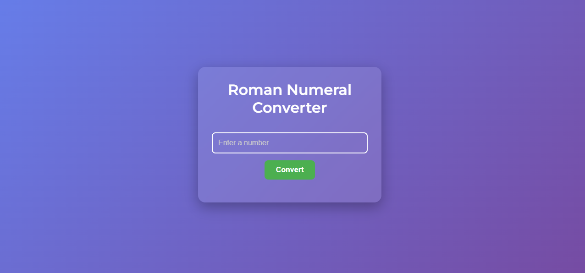

# Roman Numeral Converter

## Overview
The **Roman Numeral Converter** is a web application that takes a numeric input and converts it into its Roman numeral equivalent. This project demonstrates proficiency in front-end web development, showcasing modern styling techniques, responsive design, and clean code structure.

---

## Features

### Functionalities:
- Converts numbers into Roman numerals.
- Provides real-time feedback upon conversion.

### Design Highlights:
- **Responsive Design**: Optimized for desktop and mobile devices.
- **Modern Aesthetics**:
  - Gradient background for a visually appealing interface.
  - Glassmorphism effect on the container.
  - Smooth transitions and hover effects for interactive elements.
- **User Experience (UX)**:
  - Input focus effects to guide user interaction.
  - Clean and intuitive layout for ease of use.

---

## Technologies Used

### Front-End:
- **HTML5**: Semantic structure of the application.
- **CSS3**: Modern styling with features like gradients, flexbox, and transitions.
- **JavaScript**: Logic for converting numbers to Roman numerals.

### Additional Tools:
- **Google Fonts**: Integration of the Montserrat font for clean typography.
- **Responsive Design**: Media queries for optimized mobile display.

---

## How to Use
1. Enter a number in the input field.
2. Click the "Convert" button.
3. View the Roman numeral equivalent in the output section.

---

## Code Highlights

### Dynamic Conversion Logic
The conversion logic is implemented in JavaScript, ensuring accurate and efficient number-to-Roman numeral conversion. 

### Modern Styling
The CSS includes:
- **Gradient backgrounds**: Enhances visual appeal.
- **Hover effects**: Adds interactivity to buttons.
- **Glassmorphism**: Creates a modern, sleek container design.

---

## Why This Project?
This project was built as a portfolio piece to:
- Showcase expertise in front-end development.
- Highlight the ability to create visually appealing, responsive, and functional web applications.
- Demonstrate attention to detail and user-centric design principles.

---

## Contact
If you're interested in learning more about this project or would like to collaborate, feel free to reach out!

**Email**: [mduduzindlovu02@gmail.com](mailto:mduduzindlovu02@gmail.com)  
